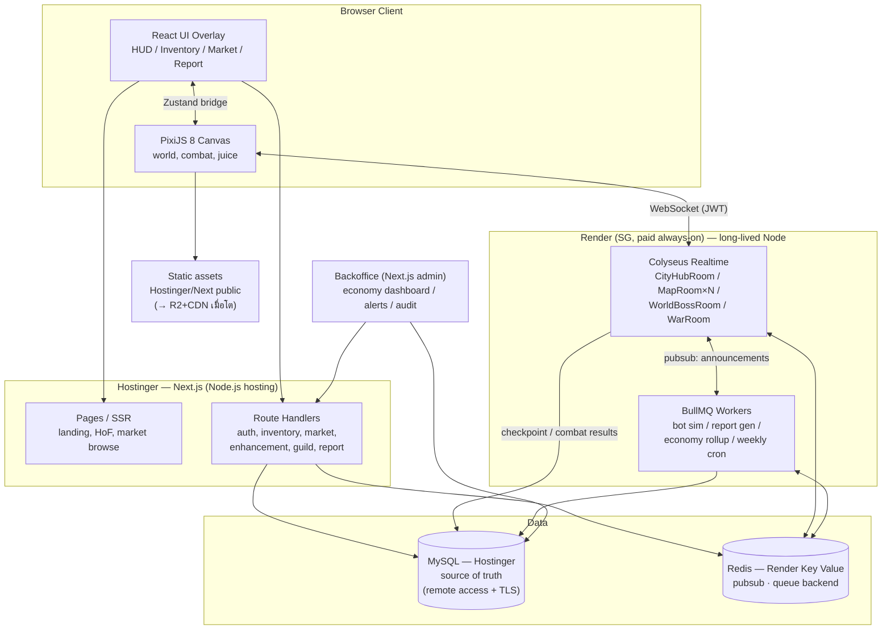

# ดึ๋งปุ๊ — Technical Architecture v1.5

> **Canonical game spec:** `deungpu_project_checkpoint_v15_p0_scope_lock_ready.md` (รวมทุก layer: v9 combat + v10 audio + v11 tech handoff + v12 spawn + v13 engine + v14 runtime + v15 P0 scope lock)
> **เอกสารแยกที่อ้างอิง:** `ENGINE_FOUNDATION_DECISIONS_v1` · `RUNTIME_BOT_CHANNEL_AND_SCHEMA_OWNERSHIP_DECISIONS_v1` · `MAP_LAYOUT_BIBLE_v1` · `MAP_SCALE_AND_SPAWN_DENSITY_SPEC_v1` · `P0_SCOPE_LOCK_v1`
> สถานะ: **P0 scope locked — เอกสารนี้คือ tech architecture ฝั่ง implementation; game semantics/balance ยึด v15**
> **v1.5 — sync กับ v15:** เพิ่ม **P0 Scope Lock (§19)** และปรับ Prototype Plan/Execution Plan ให้ P0 = **Engine Foundation Vertical Slice** ไม่ใช่ full combat/local-only slice
> **v1.4 — originally sync กับ v14 / still covered by v15:** เพิ่ม isometric engine foundation (§17), spawn/aggro system (§18), runtime decisions (reconnect/offline bot/channel); ปรับ §15/§16 ให้ **reference** v15 §48/§50.1 แทน redefine (ตาม ownership rule)
> **v1.3** — audio stack (Howler+Tone), combat foundation, design directions
> **v1.2** — Next.js บน Hostinger (Jakarta) · MySQL บน Hostinger · Realtime/Worker บน Render (Singapore, paid always-on) · Payment mock · 30 CCU · server-authoritative อนุมัติ · repo `onzipper/deung-pu-game`
> ผู้จัดทำ: Claude (Strategic/Architecture Consultant)
>
> **Ownership boundary (v15 §59.4):** Design เป็นเจ้าของ skill fields/meaning/balance/guardrails (canonical: v15 §50.1 skill schema, §48 knobs). Tech (เอกสารนี้) เป็นเจ้าของ implementation/validation/persistence/runtime/performance. **เอกสารนี้ไม่ redefine field names — อ้างอิง §50.1 และอธิบายเฉพาะวิธี implement.** เปลี่ยน scope/spec ใดๆ ต้อง owner ยืนยันก่อน

---

## 0. Executive Summary

ดึ๋งปุ๊ v9 คือ 2.5D Web MMORPG ที่มี economy จริง (market, trade, premium currency), realtime world (live hub, shared farming maps), และ background computation หนัก (bot 12 ชม., report, economy aggregation) สถาปัตยกรรมที่เหมาะกับทีมเล็กคือ:

> **Next.js (Hostinger Node.js) เป็น web shell + API ธุรกรรม | Colyseus (Render) เป็น realtime game server | BullMQ worker (Render) เป็นสมองของ bot/report/economy | MySQL (Hostinger) เป็น source of truth เดียว | PixiJS 8 เป็น renderer**

หลักการใหญ่ 3 ข้อที่ทุกระบบต้องเคารพ:

1. **Client ส่งได้แค่ intent ไม่เคยส่ง result** — damage, drop, enhancement, transaction คำนวณที่ server เท่านั้น
2. **Juice อยู่ client, Truth อยู่ server** — damage number, hit stop, screen shake, particle ทั้งหมด generate ฝั่ง client จาก event ที่ server ส่งมา ไม่ sync ทีละเลข
3. **อะไรไม่ต้อง realtime อย่าทำ realtime** — bot, report, ranking, economy metric เป็น background job ทั้งหมด ลด server cost มหาศาล

---

## 0.1 Locked Decisions (เคาะกับ Owner แล้ว)

ตารางนี้คือข้อสรุปที่ยืนยันแล้ว ถือเป็นฐานของทุก issue ที่จะร่างต่อจากนี้ การเปลี่ยนแปลงใดๆ ต้องผ่าน owner ก่อน

| # | หัวข้อ | ข้อสรุป |
|---|---|---|
| L1 | Server authority (เดิม D1) | **อนุมัติ server-authoritative** — supersede locked decision "no server-authoritative" ของ idle project เฉพาะโปรเจกต์ v9 นี้ เพราะมี market/trade/premium currency |
| L2 | Repo (เดิม D2) | โปรเจกต์ใหม่ `github.com/onzipper/deung-pu-game` (แยกจาก `deung-pu-idle-game`) |
| L3 | Database (เดิม D3) | MySQL 8 บน Hostinger |
| L4 | Game infra (เดิม D4) | Render (Singapore, **paid always-on**) — 2 services: `colyseus-rt` + `worker` |
| L5 | จำนวนอาชีพ (เดิม D5) | **5 อาชีพตาม spec** (ดาบ/หอก/ธนู/เวท/อาคม) — ไม่ลด long-term scope; ใน P0 ใช้ placeholder/manifest ให้รองรับครบ แต่ไม่ทำ production skill/art ครบ |
| L6 | Web host datacenter (เดิม D6) | Hostinger = Jakarta (อินโดนีเซีย) → จับคู่ Render Singapore |
| L7 | Hostinger plan (เดิม D7) | Node.js hosting เป็นหลัก, เสริม service อื่นตามสมควร; ต้องการ DB + Next.js อยู่ Hostinger |
| L8 | Login (เดิม D8) | **guest + email, และ guest ผูก email ตามหลังได้** |
| L9 | Payment | mock ทั้ง MVP, เป็นเฟสท้ายสุด — แต่สร้าง entitlement layer จริงตั้งแต่แรก |
| L10 | Server cap | 30 CCU เฟสแรก (ตัวเลข tune ภายหลัง) |
| L11 | Platform / control | Web-first, PC เป็นฐานหลัก, Chrome ก่อน; **control ครบสามแบบ: WASD + เมาส์ + touch** ตั้งแต่ MVP |
| L12 | Sprite grid | **iso diamond tile** (ฐาน ~64×32/tile) · player/มอนปกติ ~64px · elite ~96 · boss ~128+ · icon UI 64×64 — ดู §17.1 |
| L13 | Audio | **Howler.js (SFX/UI/ambience) + Tone.js (adaptive/layered music เท่านั้น)** — แบ่งหน้าที่ชัด ดู §22 |
| **L14** | **Camera/Projection (v15 §57.1)** | **True 2D Isometric Pixel Art · diamond grid · fixed camera · no rotation** — frame-by-frame sprite |
| **L15** | **Direction (v15 §57.2)** | **5 ทิศวาด (S/SW/W/NW/N) + mirror (SE/E/NE)** · เผื่อ 8-dir override สำหรับ boss/NPC ในอนาคต |
| **L16** | **Map world model (v15 §57.3)** | **Separated map rooms/channels + loading/fade** · ไม่มี seamless open world ใน phase 1 |
| **L17** | **Runtime (v15 §59)** | Reconnect 30s grace → same pos / safe camp fallback · Offline bot = background worker (ไม่ materialize ใน public map) · Channel auto-assign + party sync |
| **L18** | **P0 Scope Lock (v15 §61)** | **P0 = Engine Foundation Vertical Slice** — Next.js+PixiJS iso renderer, map config, movement prototype, 5-dir+mirror, realtime room skeleton, channel stub, dummy mob pockets, combat stub, debug overlay · **ห้ามลาก** account/save/bot/market/inventory/economy/production maps เข้า P0 |

---

## 1. Architecture ภาพรวม: Client-heavy หรือ Server-authoritative แค่ไหน

### คำตอบ: Hybrid แบบ "Server-authoritative economy + Client-predicted feel"

เกมนี้ **ไม่ใช่** twitch-based action (ไม่ใช่ fighting game) แต่ **มี** economy ที่ผู้เล่นแลกเปลี่ยนมูลค่ากันจริง ดังนั้น:

| ชั้น | Authority | เหตุผล |
|---|---|---|
| Movement / camera / input feel | Client-predicted, server validate หยาบ | latency ต้องรู้สึกศูนย์, โกง movement ผลกระทบต่ำ (ไม่มี loot ปล้น) |
| Combat visual / juice | Client 100% | damage number, shake, particle ไม่มีผลต่อ truth |
| Combat result (damage, HP, death) | **Server เท่านั้น** | ผูกกับ drop → ผูกกับ economy |
| Drop / RNG ทุกชนิด | **Server เท่านั้น** | หัวใจ economy |
| Enhancement / แกร่ง | **Server เท่านั้น** | มูลค่าสูงสุดในเกม |
| Market / Trade / Currency | **Server เท่านั้น + DB transaction** | เงินจริงของผู้เล่น |
| Bot simulation | **Server (worker) เท่านั้น** | ถ้า client รัน = ปิด browser แล้ว bot ตาย + โกงได้ |
| Ranking / Hall of Fame | **Server เท่านั้น** | ระบบขิงหลัก ถ้าปลอมได้เกมจบ |

### การแบ่งระบบตาม latency requirement

**ต้อง realtime (WebSocket):**
- Player movement/position ใน map ที่แชร์กัน
- Monster spawn/state/death ใน map ที่มีผู้เล่นอยู่
- Combat events (skill cast, hit results)
- City hub presence (เห็นคนอื่นเดินในนครอรุณผนึก)
- Chat, party status, world boss HP
- World/Hall of Fame announcement broadcast

**Request/Response พอ (HTTP API):**
- Login, character management
- Inventory จัดของ, equip
- Enhancement (กดตี → รอผล → ได้ result — ไม่ต้อง socket)
- Market listing/buy/search
- Trade (ทำผ่าน escrow flow เป็น steps ได้)
- Guild management, quest progress
- Report viewing, bot config

**Async / Background job:**
- Bot farming simulation (หัวใจของเกม — ดูข้อ 9)
- Report generation
- Economy metric aggregation
- Weekly reset / world condition rotation
- Ranking calculation, Hall of Fame weekly seal
- Announcement fan-out, mail/reward delivery

---

## 2. Tech Stack (ยืนพื้น Next.js)

| หมวด | เลือก | ทางเลือกรอง | หมายเหตุ |
|---|---|---|---|
| Frontend | **Next.js 15+ (App Router) + React 19 + TypeScript** | — | web shell, landing, auth pages, non-game UI, SSR สำหรับ market/wiki/HoF pages (SEO ได้) |
| Game rendering | **PixiJS 8** | Phaser 3 | ดู decision matrix ข้อ 3 — ทีมมี PixiJS ใน codebase เดิมแล้ว |
| UI overlay ในเกม | React (DOM ทับ canvas) | Pixi UI | HUD, inventory, market ใช้ React — dev เร็วกว่า, accessibility ดีกว่า |
| Input / control | **Input abstraction layer (เขียนเอง)** — keyboard/mouse/touch → intent เดียวกัน | — | L11: รองรับ WASD+เมาส์+touch; ทุก control map เป็น "ทิศเดิน + เป้าสกิล" ชุดเดียว ต่อตรงกับ protocol server; HUD responsive 2 โหมด (keybind บน PC / ปุ่มโซนนิ้วบน touch) |
| Audio | **รอเคาะ (§22)** — ตัวเต็ง Howler.js / @pixi/sound | Tone.js (future, interactive music) | L13: architecture แยก channel BGM/SFX/UI + master volume วางตั้งแต่ setting menu; asset เสียงเริ่มใส่หลัง combat feel นิ่ง |
| State (UI) | **Zustand** | Jotai | ใช้อยู่แล้ว, เบา, อยู่นอก React ได้ (bridge กับ game loop สะดวก) |
| State (game world) | Plain TS objects + ECS-lite ใน game loop | — | **ห้าม** เอา world state ใส่ React state — re-render ตาย |
| Realtime | **Colyseus** (self-host) | Socket.io + เขียน sync เอง | room = map instance ตรง concept, มี state sync + delta ในตัว |
| Backend API | **Next.js API Routes / Route Handlers** (เริ่มต้น) | แยก Fastify/NestJS ภายหลัง | ธุรกรรม + CRUD อยู่ Next.js ได้สบาย; game tick ไม่อยู่ที่นี่อยู่แล้ว |
| Database | **MySQL 8 (Hostinger)** ✅ owner decision | PostgreSQL (ถ้าย้าย infra ในอนาคต) | ดูข้อ 8 — adaptation notes สำหรับ MySQL |
| ORM | **Prisma** (ธุรกรรม/CRUD) + raw SQL (hot path, ledger) | Drizzle | Prisma ห้ามอยู่ใน combat tick loop |
| Cache / PubSub | **Redis (Render Key Value — region เดียวกับ worker)** | Upstash | ที่ 30 CCU บทบาทหลักคือ BullMQ backend + pubsub; rate limit ทำ in-memory ได้; **ออกแบบ bot run ให้ resume จาก MySQL state เสมอ** เผื่อ Redis tier ไม่ persist |
| Queue / Jobs | **BullMQ** (บน Redis) | — | bot sim, report, economy rollup, weekly cron (repeatable jobs) |
| Auth | **Auth.js (NextAuth)** ออก JWT สั้นอายุสำหรับ WS handshake | Lucia | social login + guest→register upgrade path |
| Asset storage | **เสิร์ฟ static จาก Next.js/Hostinger ไปก่อน** | R2+CDN เมื่อผู้เล่นโต | ที่ 30 CCU ไม่ต้อง CDN แต่**คง pattern content-hash filename ตั้งแต่วันแรก** เพื่อย้ายออกได้โดยไม่แตะ code |
| Observability | **Sentry** (error) + **pino → Axiom/Grafana Loki** (log) + Colyseus monitor | — | ต้องมีตั้งแต่ P1 ไม่ใช่ทีหลัง |
| Admin/Backoffice | Next.js app แยก (หรือ route group `/admin` + RBAC) | Retool ชั่วคราว | ดูข้อ 10 |
| Deploy: web | **Hostinger Node.js hosting** ✅ owner decision | — | รัน Next.js แบบ `standalone` build; ต้องยืนยัน plan type + memory limit (ดู D7) |
| Deploy: game server + workers | **Render (render.com)** ✅ owner decision — 2 services: `colyseus-rt` + `worker` | VPS ภายหลังเมื่อ cost คุ้ม | ⚠️ **ต้องเป็น paid always-on instance** — free tier spin down หลัง idle ~15 นาที = เกม server หลับ/state หาย; เลือก **region Singapore** ให้ใกล้ผู้เล่นไทยและ DB |
| Testing | **Vitest** (unit: combat formula, RNG, ledger) + **Playwright** (E2E: auth, market flow) + load test ด้วย `@colyseus/loadtest` | — | balance formula ต้องมี test ก่อน tune |

---

## 3. Rendering Layer Comparison

### Decision Matrix (คะแนน 1–5, น้ำหนักตามโจทย์เกมนี้)

| เกณฑ์ | น้ำหนัก | DOM/React | Canvas 2D | **PixiJS 8** | Phaser 3 | Three.js | WebGPU custom |
|---|---:|---:|---:|---:|---:|---:|---:|
| มอน 30–60 + damage number ถล่ม | ×3 | 1 | 2 | **5** | 4 | 4 | 5 |
| Skill effect / particle | ×3 | 1 | 2 | **5** | 4 | 4 | 5 |
| Mobile browser perf | ×3 | 2 | 3 | **4** | 4 | 3 | 3 |
| UI overlay จำนวนมาก (React ทับ) | ×2 | 5 | 4 | **5** | 3 | 3 | 3 |
| ความเร็ว prototype | ×2 | 3 | 4 | **4** | 5 | 2 | 1 |
| Maintain ระยะยาว / hiring | ×2 | 4 | 3 | **4** | 4 | 3 | 1 |
| ทีมมี codebase/ความคุ้นเคยเดิม | ×2 | 3 | 3 | **5** | 2 | 1 | 1 |
| **รวมถ่วงน้ำหนัก (max 85)** | | 41 | 47 | **78** | 64 | 52 | 48 |

### สรุปรายตัว

- **DOM/CSS/React only** — ตัดทิ้งสำหรับ combat scene: มอน 40 ตัว × damage number 5 เลข/วินาที = DOM node นับพัน, layout thrashing ตาย แต่**ใช้เป็น UI overlay** (HUD, inventory, market) คู่กับ canvas — นี่คือหน้าที่ที่ถูกต้องของมัน
- **Canvas 2D** — พอสำหรับ prototype แรกสุด แต่ไม่มี sprite batching, particle 500+ ตัวจะตันบนมือถือ ไม่คุ้มเริ่มแล้วย้าย
- **PixiJS 8** ✅ — WebGPU renderer + WebGL fallback อัตโนมัติ, sprite batching ระดับหมื่น sprite, `ParticleContainer` เกิดมาเพื่อ damage number/particle ถล่มจอ, ทำงานร่วม React overlay ง่าย (Pixi คุม canvas, React คุม DOM), และ**ทีมใช้อยู่แล้ว** จุดอ่อนตรงๆ: เป็นแค่ renderer — game loop, ECS, collision, tilemap, camera ต้องประกอบเอง (~1–2 สัปดาห์ของ foundation code ที่เขียนครั้งเดียว)
- **Phaser 3** — ครบเครื่องกว่า (physics, tilemap, animation, input, scene) prototype ไวกว่าถ้าเริ่มจากศูนย์ แต่ opinionated สูง, integrate React ทับซ้อนกว่า, และการสลับจาก PixiJS เดิม = ทิ้งความคุ้นเคย จุดที่ Phaser ชนะจริงคือถ้าทีมไม่เคยเขียน game loop เลย
- **Three.js** — ได้ perspective/กล้อง 3D จริง แต่เกมนี้เป็น sprite-based 2.5D **true isometric + fixed camera** (v15 §57.1) — จ่าย complexity 3D scene graph เพื่อสิ่งที่ 2D iso projection + depth sort ทำได้ = overkill
- **WebGPU custom** — เร็วสุดในทางทฤษฎี แพงสุดในทางปฏิบัติ ไม่ใช่ตอนนี้

### คำแนะนำ: **PixiJS 8** + **isometric** foundation layer ของตัวเอง

สิ่งที่ต้องเขียนเอง (ครั้งเดียว ใช้ทั้งเกม): fixed-timestep game loop, entity registry แบบ ECS-lite, **isometric coordinate system + diamond-grid projection (จอ↔world)**, spatial hash grid บน iso grid (collision + AOI), **iso depth-sorted tilemap/entity renderer**, camera + culling, direction resolver (5-dir+mirror), object pools, asset loader (atlas manifest)

> ⚠️ v15 §57.1 ล็อก **True Isometric** — foundation layer นี้ต้องเขียนแบบ iso ตั้งแต่ P0 ไม่ใช่ทำ top-down ก่อนแล้วแปลง (จะเสียเวลาแปลง coordinate ซ้ำ) รายละเอียดเต็มดู **§17 Engine Foundation**

---

## 4. High-Level System Architecture



**เส้นทาง data สำคัญ:**
- Announcement: worker/API → Redis pubsub → ทุก Colyseus room → broadcast → client toast
- Combat: client intent → MapRoom คำนวณ → apply state + queue drop ลง MySQL (batched) → broadcast result event
- Market: client → Next.js API → MySQL transaction → Redis invalidate cache → (ถ้าสำเร็จ) pubsub แจ้งผู้ขาย

---

## 5. Module Breakdown

| Module | หน้าที่ | ฝั่ง | Data สำคัญ | Realtime? | Complexity/Risk |
|---|---|---|---|---|---|
| Account / Character | สมัคร, login, สร้างตัวละคร, class | Next.js API | users, characters | ไม่ | ต่ำ |
| Inventory | เก็บ/จัด/stack ของ | Next.js API (+RT sync event) | inventory_items | event push พอ | กลาง — ต้อง transaction ทุก mutation |
| Equipment | สวม/ถอด, stat รวม | Next.js API | equipment, stat cache | ไม่ | ต่ำ–กลาง |
| Enhancement / Forge | ตีบวก, รอยร้าว, แกร่ง | **Next.js API (server RNG)** | enhancement_logs, item state | ไม่ (ผล + announcement push) | **สูง** — RNG integrity + announcement + HoF hook |
| Skill / Combat | damage calc, cooldown, AoE hit | **Colyseus room** | skill defs (config), combat state (in-memory) | **ใช่** | **สูงสุด** — perf + authority + feel |
| Monster / Spawn | spawn table, AI, pack, wave | Colyseus room + config จาก backoffice | spawn configs, mob state (in-memory) | **ใช่** | สูง — AI LOD, pack 30–60 |
| Map / Zone | **iso tilemap** (§17), zone rule (Safe/Contested/Risk sub-zone §17.8), separated instance | Colyseus + static data บน host | map manifests, zone rules, pocket config | ใช่ | กลาง–สูง (iso foundation) |
| Bot / Auto Pilot | จำลองฟาร์มตาม profile/tier | **BullMQ worker** (+materialize ใน room) | bot_profiles, bot_runs | ไม่ (ยกเว้น materialize) | **สูง** — ดูข้อ 9 |
| Report | สรุปผล bot/กิจกรรม | Worker สร้าง, API อ่าน | bot_run_reports | ไม่ | ต่ำ–กลาง |
| Market / Auction | listing, buy, tax, price history | **Next.js API + MySQL transaction** | market_listings, market_transactions | cache invalidate + notify | **สูง** — integrity + abuse |
| Trade | P2P escrow trade | Next.js API (state machine) | trades, trade_items | notify พอ | สูง — dupe exploit คือความเสี่ยงอันดับหนึ่งของ MMO |
| Party | ตั้งปาร์ตี้ 6 คน, share loot rule | Colyseus + Redis (ephemeral) | party state (Redis) | ใช่ | กลาง |
| Guild | สมาชิก, donation, guild boss | Next.js API + RT event | guilds, guild_members | บางส่วน | กลาง |
| Hall of Fame | weekly/eternal records, ฉายา | Worker aggregate + API | hall_of_fame_records | announcement push | กลาง — ต้อง audit ได้ |
| Announcement | world/feed/toast | Worker + Redis pubsub → rooms | announcements | **ใช่** (push) | ต่ำ |
| Weekly World Condition | rotation, scheduler | BullMQ repeatable job | world_events, config versions | push ตอนเปลี่ยน | กลาง |
| Economy Backoffice | dashboard, alert, control | Backoffice app + workers | economy_metrics, audit_logs | ไม่ | กลาง–สูง (ถูกใช้ตัดสินใจจริง) |
| LiveOps | event schedule, merchant control | Backoffice + config table | event configs (versioned) | push ตอน apply | กลาง |
| Raid / Boss | instance 6 คน, mechanic, first-clear rule | Colyseus dedicated room | raid state, lockouts | **ใช่** | สูง |
| Secret Quest | trigger/clue/hidden state | API + flags ใน quest_progress | quest_progress, secret flags | ไม่ | กลาง — อย่า leak ผ่าน client bundle |
| PvP / Risk Zone | opt-in combat, no-loss rule, system reward | Colyseus (MapRoom mode) | pvp_results | **ใช่** | สูง — fairness + effect normalize |

---

## 6. Realtime Model

### ต้องใช้ WebSocket ไหม → ใช่ ไม่มีทางเลือกอื่น
Live hub + shared farming maps + world boss = bidirectional push ตลอดเวลา (SSE ไม่พอเพราะ client ต้องส่ง input ถี่, WebRTC เกินจำเป็น)

### Socket.io vs native ws vs Colyseus vs custom

| | Socket.io | native ws | **Colyseus** | Custom |
|---|---|---|---|---|
| Room/instance concept | มีแบบบาง | ไม่มี | **มีเต็ม (ตรง map instance)** | เขียนเอง |
| State sync + delta | เขียนเอง | เขียนเอง | **มีในตัว (Schema, binary, delta)** | เขียนเอง |
| Interest management | เขียนเอง | เขียนเอง | มีพื้นฐาน + ต่อยอด | เขียนเอง |
| Scaling หลาย node | adapter (Redis) | เขียนเอง | Redis presence + proxy (มี pattern) | เขียนเอง |
| ความเสี่ยง | เขียน sync เอง = bug netcode เดือนๆ | สูงสุด | lock-in framework ระดับหนึ่ง | เวลาทีมหมดไปกับ infra |
| เหมาะกับ | app ทั่วไป, chat | protocol ตัวเอง | **room-based game — เคสนี้ตรงๆ** | ทีมใหญ่ |

**เลือก Colyseus** — เหตุผลชี้ขาด: MapRoom = Colyseus Room แบบ 1:1 ทาง concept, ประหยัดเวลาเขียน state sync ~เดือน, และทีมเล็กควรใช้เวลากับ game logic ไม่ใช่ netcode ความเสี่ยง lock-in ยอมรับได้เพราะ message protocol ออกแบบให้ abstract ได้

### Map instance / channel จัดการอย่างไร (v15 §57.3, §59.3)
- **เฟสแรก: server cap 30 CCU (owner decision)** → Colyseus instance เดียว, ไม่ต้อง Redis presence/multi-node, 1 channel ต่อ map พอ — ที่เหลือคือ design สำหรับตอนขยาย ซึ่งโครง room naming รองรับไว้แล้วโดยไม่ต้องรื้อ
- 1 map = room/channel แยก, **แต่ละ map เป็น instance ของตัวเอง** (separated, ไม่ seamless), ข้าม map = โหลดฉากใหม่ + fade
- **Channel = auto-assign ตาม load/population** (ไม่มี manual selector ใน P1; UI แสดง channel ปัจจุบัน เช่น `CH.1`); เต็มแล้ว spawn channel ใหม่ (ch.1, ch.2); engine เผื่อ manual switch ภายหลัง
- **Party sync สำคัญกว่า solo auto-assign** — สมาชิกปาร์ตี้ถูกส่งไป channel เดียวกัน; channel เต็ม → หา channel ที่รับทั้งกลุ่มได้; สมาชิกหลุดคนละ channel → prompt "ย้ายไปหา party"
- ห้ามย้าย channel ระหว่าง combat; ห้ามใช้ channel switch หนี PvP/death/reset มอน (anti-exploit)
- City hub ใช้ cap สูงกว่า (~80–100) เพราะไม่มี combat — เห็นคนเยอะสำคัญกว่า interaction แน่น
- Party/raid = private room, World boss/event = dedicated/priority channel ที่ join จาก map (อาจ lock channel ตาม event rule)
- Room state persist เป็น checkpoint ลง MySQL เป็นระยะ (mob ไม่ต้อง persist, player position persist ตอน leave)

### Reconnect (v15 §59.1)
- **30s grace reconnect** ผ่าน Colyseus `allowReconnection` — ภายใน 30 วิ: กลับ room/channel/ตำแหน่งเดิม + party เดิม, restore state เท่าที่ server ยัง hold
- เกิน 30 วิ / room ปิด / state corrupt → กลับ **safe camp** ของ map นั้น; severe invalid เท่านั้นค่อย fallback เมืองหลัก
- **Server state ปัจจุบัน = source of truth** — ไม่ guarantee มอนที่ตีอยู่ยังครบ 100%; ตำแหน่งเดิม unsafe/invalid → ย้าย safe camp
- Anti-exploit: reconnect/channel switch ห้ามใช้หนีตาย; combat/PvP/boss critical state บังคับ safe camp ได้
- Tech: session timeout + seat reservation + reconnection token + position validation

### Player movement sync
- **Client-side prediction + server validation หยาบ + interpolation** (ไม่ใช่ rollback netcode — ไม่จำเป็นเพราะ PvP ไม่มี loss และไม่ใช่ twitch)
- Client ส่ง input/target position ~10–15Hz → server ตรวจ speed cap, wall clip, teleport → ยอมรับหรือ snap กลับ
- Server broadcast positions 10Hz → client อื่น interpolate (render ย้อนหลัง ~100–150ms) นุ่มพอสำหรับ iso movement; position เป็น world coordinate, client แปลงเป็น iso screen เอง
- อย่า broadcast 60Hz เด็ดขาด — bandwidth × ผู้เล่น² จะฆ่า server

### Monster state sync
- Spawn/AI/HP/death อยู่ server ทั้งหมด, client รับ: spawn event (ครั้งเดียว), position delta (เฉพาะตัวที่ขยับ, 5–10Hz, ผ่าน AOI filter), state change events (aggro, hit, die)
- Death animation / แตกเป็นเมือก / loot explosion = client เล่นเองจาก die event — server ไม่รู้จัก particle
- Mob ที่ไกลผู้เล่นทุกคนใน room → AI tick ลดเหลือ 1–2Hz (LOD simulation)

### Combat result คำนวณที่ไหน
- **Server (MapRoom) เท่านั้น**: client ส่ง `cast_skill {skillId, aimPos/targetId}` → server ตรวจ cooldown/mana/range → คำนวณ AoE hit จาก spatial hash → roll damage/crit → apply → broadcast `skill_result {casterId, skillId, hits:[{mobId, dmg, crit, killed}], overkill?}`
- Client เล่น animation ทันทีที่กด (ไม่รอ server) → พอ result มา (~50–150ms) ค่อยเด้งเลข/ตายจริง — ที่ latency ระดับนี้ผู้เล่นแยกไม่ออก เพราะ anticipation frame ของสกิล (ตาม 17.4) กินเวลานั้นพอดี

### Damage number: sync หรือ generate client-side?
- **Generate client-side จาก server result** — server ส่งก้อนเดียว `{mobId, dmg: 4820, crit: true, multihit: 5}` → client แตกเป็น 5 เลขเด้ง, จัด font/สี/คำพิเศษ ("ทะลวง!") ตาม cosmetic setting ของผู้เล่นแต่ละคน
- ผลพลอยได้: Damage Number Mode (Full/Compact/Critical Only/Off) และ cosmetic ทั้งหมดเป็น client-side ล้วน ไม่แตะ network เลย — ตรง design 17.14 พอดี

### World boss / party / guild event sync
- World boss: dedicated room, HP broadcast แบบ throttle (2–4Hz หรือเมื่อเปลี่ยน >0.5%), contribution นับฝั่ง server
- Party: state ใน Redis + push ผ่าน room ที่สมาชิกอยู่ (ข้าม map ได้)
- Guild/world announcement: Redis pubsub → ทุก room → client toast/feed — ห้าม loop ยิง HTTP

---

## 7. Server Authority Model

> ⚠️ ข้อนี้คือจุด supersede locked decision เดิม ("no server-authoritative") — จำเป็นเพราะ v9 มี trade + market + premium currency: ระบบใดที่ client เป็นคนบอกผล ระบบนั้นจะถูกปลอมภายในสัปดาห์แรกที่มีผู้เล่นเกินร้อยคน และความเสียหายไหลเข้าตลาด = เศรษฐกิจทั้งเกมพัง ย้อนกลับไม่ได้

**Server-authoritative เท่านั้น (client ห้ามมีสิทธิ์แม้แต่เสนอผล):**

| ระบบ | กลไกบังคับ |
|---|---|
| Damage calculation | สูตรอยู่ server, client รู้แค่ result |
| Drop result | RNG server + drop table เป็น server config (ไม่ ship ใน bundle) |
| Enhancement success/fail/-1/ร้าว | RNG server + เขียน enhancement_logs ทุกครั้ง (audit) |
| การใช้แกร่ง | ต้อง confirm token 2 จังหวะ (ขอ → ยืนยัน) กัน replay/bot misuse |
| Market transaction | MySQL transaction: lock listing row → ตรวจเงิน → โอน item + เงิน + tax → commit; ล้มเหลว = rollback ทั้งก้อน |
| Trade | State machine ฝั่ง server (draft → both_locked → both_confirmed → executed) แก้ item หลัง lock = reset confirm ทั้งคู่ — กัน dupe/switcheroo |
| Inventory changes ทุกชนิด | ผ่าน API/room handler ที่ตรวจ ownership + version (optimistic lock) |
| Premium currency (เพชร) | **Double-entry ledger** — ไม่มี `balance` column ให้ UPDATE ตรงๆ ยอดคือ SUM ของ ledger; ทุกแถวมี reason + reference |
| Hall of Fame record | มาจาก server-side event log เท่านั้น (combat result, enhancement log) ไม่รับค่าจาก client |
| Weekly ranking | worker aggregate จาก event log, seal ตอนปิดสัปดาห์ (immutable) |
| Bot output | คำนวณใน worker ทั้งหมด — client แค่ตั้ง profile |
| Zone rule / PvP flag | server ตัดสินว่าตีใครได้ ตาม zone + opt-in state |

**Client-authoritative ได้ (เพราะไม่มีผลต่อมูลค่า):** ตำแหน่งกล้อง, cosmetic setting, effect quality, damage number style, UI layout, การเล่น animation/เสียง

**หลักตรวจสอบ:** ทุก endpoint ถามตัวเองว่า "ถ้าผู้เล่นเขียน script ยิง request นี้ตรงๆ 1000 ครั้ง/วินาที ด้วย payload ปลอม จะได้เปรียบไหม" — ถ้าใช่ ต้องมี server check + rate limit + audit log

---

## 8. Database Model (เบื้องต้น)

### เลือก engine

| | PostgreSQL 16 | MySQL 8 ✅ (owner decision — Hostinger) |
|---|---|---|
| JSONB (item affix, bot profile, report payload) | ดีมาก + index ได้ | JSON ใช้ได้แต่ index/query อ่อนกว่า |
| Advisory lock (กัน double-spend ราย entity) | มี | ทำผ่าน GET_LOCK ได้แต่ semantics อ่อนกว่า |
| Partial index (เช่น listing ที่ active เท่านั้น) | มี | ไม่มี |
| ทีมมี codebase เดิม | ❌ (เดิมคือ MySQL) | ✅ |

**ตัดสินใจแล้ว (v1.1): MySQL 8 บน Hostinger** — Prisma ทำให้ schema เกือบเหมือนเดิม สิ่งที่ต้อง adapt จาก design เดิม:

- JSONB → **JSON column** ของ MySQL (affixes, bot profile, report payload) — query ได้, index ผ่าน generated column เฉพาะ field ที่ค้นบ่อย
- Advisory lock → **`SELECT ... FOR UPDATE`** row lock ในทุก transaction ที่แตะ inventory/listing/ledger (pattern เดียวใช้ทั้งเกม)
- Partial index ไม่มี → ใช้ composite index `(status, ...)` แทน เช่น `(status, item_type)` บน market_listings
- Ledger / append-only / optimistic version — **เหมือนเดิมทุกประการ ไม่กระทบ**

**Operational notes สำหรับ Hostinger MySQL (สำคัญ):**
1. ต้องเปิด **Remote MySQL** ให้ Render เชื่อมได้ + บังคับ **TLS** บน connection string — เส้นนี้วิ่ง public internet
2. เช็ค **max_connections / max_user_connections ของแพลน** — จำกัด pool: Next.js pool ≤10, Colyseus pool ≤5, worker pool ≤5 (ที่ 30 CCU เหลือเฟือ เพราะ combat ไม่แตะ DB ต่อ tick อยู่แล้ว)
3. เส้น Render↔Hostinger มี latency ข้าม network — ยิ่งตอกย้ำกติกา "combat state in-memory, DB เฉพาะผลลัพธ์แบบ batched"
4. **Backup:** ตั้ง mysqldump อัตโนมัติรายวัน + เก็บนอก Hostinger (เกมมี economy จริง — ข้อมูลหาย = จบ)

### Entities หลัก (entity → relation → หมายเหตุ)

```
users 1─N characters
characters 1─N inventory_items          # jsonb affixes, stack_count, version (optimistic lock)
characters 1─N equipment                # enhance_level, crack_state, slot
equipment 1─N enhancement_logs          # append-only: before, after, material_used, rng_roll, result
characters 1─N market_listings          # status: active/sold/cancelled/expired, price, tax_paid
market_listings 1─1 market_transactions # buyer, seller, executed_at — append-only
trades N─N characters (2 ฝั่ง)          # state machine column, locked_at, confirmed_a/b
trades 1─N trade_items
guilds 1─N guild_members (N─1 characters)
characters 1─N quest_progress           # รวม secret flags (server-side เท่านั้น)
characters 1─N bot_profiles             # jsonb config: skill logic, stop conditions, risk opt-in, tier
bot_profiles 1─N bot_runs               # started_at, ends_at, map, state
bot_runs 1─1 bot_run_reports            # jsonb summary: kills, loot, gold, events, secret_hints
hall_of_fame_records                    # category, week_id, character_id, value, evidence_ref, sealed
announcements                           # scope: world/guild/city, ttl
world_events                            # weekly condition, schedule, config_version
economy_metrics                         # time-series rollup (partition by day)
audit_logs                              # append-only: actor(user/staff/system), action, before/after, ip
currency_ledger                         # double-entry: character_id, currency(gold/mark/diamond), delta, reason, ref_type, ref_id
```

### กติกาสำคัญ
1. **Currency = ledger เสมอ** ทั้ง 3 สกุล — balance คือ materialized SUM (cache ใน Redis, reconcile รายวัน)
2. **Append-only tables** (enhancement_logs, transactions, audit, ledger, HoF) — ไม่มี UPDATE/DELETE → rollback ทำโดย compensating entry ไม่ใช่ลบแถว
3. **Hot combat state ไม่แตะ DB** — mob HP, cooldown อยู่ใน room memory; สิ่งที่เขียนลง DB คือผลลัพธ์ (loot granted, xp granted) แบบ batched ทุก 2–5 วิ หรือทันทีเมื่อมูลค่าสูง
4. **Redis เก็บ:** session, room presence, party state, market search cache (TTL สั้น), rate limit counters, pubsub — **Redis ไม่ใช่ source of truth ของอะไรทั้งนั้น**

---

## 9. Bot / Auto Pilot Technical Approach

### เทียบ 4 แนวทาง

| แนวทาง | ข้อดี | ข้อเสีย | ตัดสิน |
|---|---|---|---|
| Client-side | server ฟรี | ปิด browser = bot ตาย (ขัด Pro 12 ชม. โดยตรง), ปลอม output ได้ 100% | ❌ ตัดทิ้ง |
| Server-side full sim (bot วิ่งใน Colyseus room จริงเหมือน player) | เห็นจริง สมจริงสุด | bot 1 ตัวกิน CPU ≈ player 1 คน → 5,000 bot = จ่ายเท่า 5,000 CCU ทั้งที่ไม่มีคนดู | ❌ แพงเกินโดยไม่จำเป็น |
| Background worker (coarse simulation) | ถูกมาก — คำนวณเป็นช่วงเวลา ไม่ต้อง tick ละเอียด, deterministic, audit ง่าย | ไม่มีตัวตนใน map ให้ใครเห็น | ✅ เป็นแกน |
| **Hybrid (worker เป็นแกน + materialize เมื่อถูกมองเห็น)** | ได้ทั้งความถูกและ "เห็น bot ฟาร์มใน map" ตาม design | ซับซ้อนขึ้นหนึ่งขั้น — ต้อง sync สอง representation | ✅ **แนะนำ** (แบบ phased) |

### สถาปัตยกรรมที่แนะนำ

**แกน: Time-sliced coarse simulation ใน BullMQ worker**
- bot run 12 ชม. = job chain, simulate เป็น slice ละ ~5 นาทีเกม/ครั้ง
- ต่อ slice: คำนวณจาก kill-rate model (DPS ตัวละคร × mob density × pack size × uptime) → kills → roll drops ด้วย **server RNG ชุดเดียวกับผู้เล่นจริง** → gold/xp/material → เขียน incremental ลง bot_runs + ledger
- Skill logic ตาม profile (Pro): แปลงเป็น parameter ของ model (เช่น "ultimate เมื่อมอน ≥12" → ปรับ burst efficiency) ไม่ต้อง simulate ทีละ frame
- Stop conditions / risk opt-in / ห้ามใช้เพชร / ห้ามใช้แกร่ง → enforce เป็น **action allowlist ต่อ tier ใน worker** — bot ไม่มี code path ไปแตะเพชรเลยแม้อยากแตะ
- ผลลัพธ์เชิงระบบ: bot 10,000 ตัว = งาน queue ที่ predictable, ไม่ใช่ CCU

**Online vs Offline (v15 §59.2 — ล็อกแล้ว):**
- **Online bot** (เจ้าของยัง online): ตัวละครอยู่ใน map จริง, ผู้เล่นอื่นเห็น, **ใช้ spawn จริง/แย่งมอนจริงตามปกติ** — เหมือน player ที่ระบบคุมแทน
- **Offline Pro bot** (เจ้าของ logout): รันเป็น **background worker simulation (coarse) เท่านั้น**, ตัวละคร **ไม่ materialize ใน public map**, **ไม่แย่ง spawn pocket กับผู้เล่นจริงโดยตรง**, output คุมด้วย route/density/economy config
- เหตุผล: กัน public map เต็มไปด้วย offline bot, ลด server/pathfinding/visual load, คุม economy ง่าย, โลก public ยังรู้สึกมีผู้เล่นจริงไม่ใช่ bot เต็ม field
- **Ghost/private bot visualization = future optional** (ไม่ใช่ foundation ตอนนี้); ถ้าทำภายหลังต้อง **ไม่กิน spawn จริงของ public map**
- Offline simulation ต้องอิง: route config + map density spec + spawn density spec + gold/item-per-hour guardrail + telemetry + economy backoffice (ผูกกับ §18 spawn spec)

**Report:** จบ run/slice สำคัญ → worker ประกอบ bot_run_reports (jsonb): kills ต่อ family, loot สำคัญ, gold curve, เหตุการณ์ (เจอ elite, หนี risk zone), secret hint ("ร่องรอยขาดหาย...") → API อ่านตอน login ตาม Returning Flow

**ความเสี่ยงตรงๆ:** kill-rate model ต้อง calibrate กับผลเล่นจริง ไม่งั้น bot ฟาร์มเก่ง/ห่วยกว่าคนผิดธรรมชาติ → economy เพี้ยน → ต้องมี "shadow comparison" ใน backoffice เทียบ output bot vs ผู้เล่นจริงต่อชั่วโมงต่อ map ตั้งแต่ P3

---

## 10. Economy / LiveOps / Backoffice

### Data pipeline

```
ทุก economic event (gold delta, item create/destroy, enhancement, market tx, bot output)
  → เขียน economy_events (partitioned append-only) พร้อมธุรกรรมหลัก
  → BullMQ rollup worker (ทุก 5 นาที + hourly + daily)
  → economy_metrics (time-series rollup)
  → Alert engine: threshold + moving-average deviation
      - gold inflation: net gold creation rate เทียบ 7-day MA
      - item flood: supply ต่อ item เทียบ demand (listing/sale ratio)
      - value collapse: median price drop > X% ใน Y ชม.
      - enhancement anomaly: success rate จริง vs ค่า config (จับ bug/exploit)
      - bot output spike: output/ชม. ต่อ tier เกิน band
      - rare concentration: top-N holders ถือ % เกิน threshold
      - แกร่ง supply เกิน projection
  → Alert Center ใน backoffice → staff ตัดสินใจ (ตาม principle: Alert → Evidence → Trend → Recommendation → Staff Decision)
```

### Backoffice app
- Next.js แยก deployment (หรือ `/admin` route group) + RBAC (viewer / operator / admin) + **2FA บังคับ**
- หน้า: Economy Dashboard, Item Monitor, Bot Output Monitor, Merchant/Event Control, Enhancement Monitor, Alert Center, Audit Log — ตรง v9 §11
- **ทุก write action ของ staff → audit_logs (before/after, actor, ip)** ไม่มีข้อยกเว้น
- **Config เป็น versioned rows** (drop tables, enhancement rates, merchant stock, world condition): apply = ชี้ active version ใหม่, rollback = ชี้ version เก่า — ไม่มีการแก้ config in-place → "rollback/safe config" ได้จริงในคลิกเดียว
- Wandering merchant / world condition scheduler = BullMQ repeatable jobs อ่านจาก config table
- กราฟใช้ library ตรงๆ (Recharts/ECharts) — อย่าเพิ่งลงทุน Grafana stack จนกว่า metric จะนิ่ง

---

## 11. Performance Strategy

### Rendering (PixiJS)
- **Object pooling ทุกอย่างที่เกิด-ตายถี่:** mob sprites, damage numbers, particles, loot drops, skill effects — ไม่มี `new` ใน hot loop, GC pause คือศัตรูอันดับหนึ่งบนมือถือ
- **Damage number:** `BitmapText` (ไม่ใช่ Text — ไม่ rasterize ใหม่ทุกเลข) + pool 300–500 ตัว + เกิน budget/target → รวมก้อน ("จำนวนรวมต่อ 0.5 วิ") ตาม design 17.10 อยู่แล้ว
- **Particle:** `ParticleContainer` ต่อ effect family, cap ต่อ quality tier, ไกลจอ = ตัด
- **Texture atlas ต่อ monster family** (7 families = ~7 atlas + shared) → batching สูงสุด, draw call ต่ำ
- **Culling:** วิ่งบน spatial hash — sprite นอก viewport+margin ไม่ update transform
- **Iso depth-sort เฉพาะ dirty entity** ไม่ sort ทั้ง scene ทุก frame (§17.2)
- **Effect Quality (Low/Med/High/Cinematic)** map เป็นตัวเลขจริง: max particles, shake amplitude, mob effect ของผู้เล่นอื่น, resolution scale (0.75× บน Low), death animation length
- Boss telegraph วาดใน layer เหนือ effect เสมอ + ไม่โดน quality setting ตัด (กติกา 18.5)

### Simulation (server)
- Fixed tick 10–15Hz ต่อ room (ไม่ใช่ 60 — เกมนี้ไม่ต้อง)
- Mob AI LOD: ใกล้ผู้เล่น = full tick, ไกล = 1–2Hz, ไม่มีใครใน AOI = หลับ (spawn state เท่านั้น)
- Spatial hash grid ใช้ร่วม: AoE hit test ฝั่ง server และ AOI filter ฝั่ง network

### Network
- **Interest management (AOI):** ผู้เล่นรับ update เฉพาะ entity ในรัศมี ~1.5 จอ — wave 60 ตัวไม่ได้แปลว่าทุก client รับ 60 stream
- Position updates: quantize (int16 grid), delta only, 10Hz, batch เป็น packet เดียวต่อ tick
- Damage: ส่งผลรวมต่อ cast ไม่ใช่ต่อ hit (client แตกเลขเอง — ข้อ 6)
- Throttle ต่อ client: mobile/สัญญาณแย่ negotiate rate ลงได้

### Map / Content
- Iso tilemap แบ่ง chunk, lazy load ตาม camera, unload ไกล (§17.1)
- Spawn pocket ผูก chunk/zone — pocket ไม่ active ไม่มี mob simulation (§18.1)
- Asset: preload เฉพาะ atlas ของ map ปัจจุบัน + UI, ที่เหลือ background load; audio sprite รวมไฟล์

### Budget ที่ต้อง hold (นิยาม success ของ P0)
- P0 ต้องพิสูจน์ **engine foundation** ก่อน: iso renderer, depth sorting, movement prototype, 5-dir+mirror, room/channel skeleton, dummy mobs และ combat stub
- Desktop กลางๆ: 60fps ที่ prototype map + dummy mobs 20–40 + damage number/effect placeholder ระดับ P0
- มือถือกลาง (เช่น Android ระดับกลางอายุ 2–3 ปี): 30fps ที่ prototype map + dummy mobs ~20–30, quality Low
- ถ้า P0 ไม่ผ่าน budget นี้ → แก้ renderer/foundation ก่อน ไม่รีบเพิ่ม gameplay/economy

---

## 12. MVP / Prototype Plan

| Phase | เป้าหมาย | ระบบที่ทำ | Tech ที่ต้องพิสูจน์ | Risk ที่ทดสอบ | Success Criteria |
|---|---|---|---|---|---|
| **P0 — Engine Foundation Vertical Slice** | พิสูจน์ว่า browser engine ของดึ๋งปุ๊รันได้จริง | Next.js+PixiJS 8 scene, **iso foundation (§17)**, P0 Test Field config, local movement prototype, 5-dir+mirror sprite placeholder, realtime room skeleton, channel stub, dummy mob pockets, combat stub, debug overlay | iso projection/depth-sort, lifecycle, map config loader, movement/collision, animation manifest, Colyseus join/leave/position sync | renderer coordinate เพี้ยน, depth sort ผิด, room sync พัง, scope creep | เปิด 2 browser เห็นกัน, player เดินใน iso map ได้, depth sorting ถูก, sprite mirror ทำงาน, dummy mobs spawn ใน pocket, combat stub แสดง effect/damage dummy, debug overlay ครบ |
| **P1 — World Sync** | คน 2–5 เห็นกันและตีมอนร่วมกัน | Colyseus MapRoom, **iso tilemap+chunk**, movement predict/interp, mob AI server + **aggro/leash/pull (§18.3)**, skill intent→result, **spawn pocket (§18.1)**, reconnect 30s + channel auto-assign+party sync (§6), city hub | Colyseus schema/delta, AOI (**บังคับ §18.2**), tick loop, JWT handshake, reconnect token | latency feel, room CPU ต่อหัว, desync, reconnect exploit | เล่น 4 คน network จริงไม่หน่วง; room 40 CCU CPU < 1 core; reconnect กลับตำแหน่งได้ |
| **P2 — Persistence & Value** | ของมีมูลค่าและปลอดภัย | MySQL schema, inventory transaction (`FOR UPDATE`), drop จาก server RNG, enhancement เต็ม (fail/-1/ร้าว/แกร่ง 2-step confirm), currency ledger | Prisma transaction + row lock, optimistic lock, ledger, RNG audit log | dupe ผ่าน concurrent request, ledger ถูกต้อง 100% | ยิง concurrent 1,000 req แล้ว inventory/เงินไม่เพี้ยนแม้แต่หน่วยเดียว |
| **P3 — Bot & Report** | value prop หลักของเกมทำงานจริง | BullMQ bot sim (coarse), profile/tier allowlist, stop conditions, report generation + UI, shadow comparison dashboard เบื้องต้น | job chain 12 ชม. รอด restart, determinism, kill-rate calibration | bot output เพี้ยนจากผู้เล่นจริง, worker crash กลาง run | bot output/ชม. อยู่ใน ±15% ของผู้เล่นจริง map เดียวกัน; run 12 ชม. รอด deploy/restart |
| **P4 — Market** | เศรษฐกิจผู้เล่นหมุนจริง | listing/buy/cancel, tax sink, price history, search+cache, notify ผู้ขาย | MySQL row lock (`FOR UPDATE`) ใต้ contention, cache invalidation | race สอง buyer ชิง listing เดียว, listing spam | ไม่มี oversell ภายใต้ load test; p95 buy < 300ms |
| **P5 — HoF & Announcement** | ระบบขิงครบ loop | event log → weekly aggregate → seal, ฉายา+reward grant, announcement pubsub → toast ทุก room, feed page (SSR) | pubsub fan-out, weekly cron ถูกต้องข้าม timezone | record ปลอม/ซ้ำ, ประกาศ spam | ทุก record ตรวจย้อนถึง evidence ได้; ประกาศถึงทุก client < 2 วิ |
| **P6 — LiveOps & Backoffice** | ทีมคุมเกมได้โดยไม่ต้อง deploy | dashboards, alert engine, versioned config + rollback, merchant/world condition control, audit ครบ | rollup pipeline, config versioning apply แบบ live | staff error ทำเกมพัง, alert หลอกถี่ | rollback config ได้ใน 1 คลิก; alert หลักจับ scenario จำลองได้ครบ |

**กติกาเรียงเฟส:** P0 อยู่แรกเพื่อพิสูจน์ engine foundation ให้เดินได้ก่อน — renderer/movement/room/channel ถ้าไม่ผ่าน จะต่อ combat/economy ไม่คุ้ม และ **อย่าข้าม P2 ไป P4** — market ที่วางบน inventory ที่ dupe ได้คือหายนะ

---

## 13. Technical Risks & Mitigations

| # | ความเสี่ยง | ระดับ | ผลกระทบ | Mitigation |
|---|---|---|---|---|
| 1 | **ยัดทุกอย่างลง host เดียว** — Hostinger Node hosting เหมาะกับ Next.js web/API แต่ไม่ควร host Colyseus/worker บนแพลนเดียวกัน (process/memory limit + restart policy ไม่เหมาะ long-lived room) | สูง (ถ้าไม่รู้ตั้งแต่แรก) | สถาปัตยกรรมต้องรื้อกลางทาง | แยก game infra ไป Render ตั้งแต่ P1 (✅ ตัดสินใจแล้ว); Next.js ทำเฉพาะ web + API ธุรกรรม |
| 2 | Browser/mobile performance ไม่ถึงกับ horde 30–60 | สูง | ต้องลดสเกล combat = กระทบ core fantasy | P0 ทดสอบก่อนทุกอย่าง + quality floor + ยอมลด pack size ฝั่ง design ถ้าจำเป็น |
| 3 | Server cost บานจาก realtime + bot | กลาง–สูง | burn rate | bot = coarse sim (ข้อ 9), AOI + tick 10Hz, room autoscale ตาม CCU, VPS แทน PaaS เมื่อโตพอ |
| 4 | Cheating / exploit (dupe, forged result, replay) | สูง | เศรษฐกิจพังถาวร ย้อนไม่ได้ | intent-only protocol, transactions + optimistic lock, ledger, rate limit, audit ทุก mutation, แกร่ง 2-step confirm |
| 5 | Bot ทำ economy เฟ้อ | กลาง–สูง | มูลค่า material ดิ่ง ผู้เล่น active หมดแรงจูงใจ | output ผูก formula เดียวกับผู้เล่น + shadow comparison + backoffice alert + tier cap ตาม design |
| 6 | Market abuse (ปั่นราคา, wash trade) | กลาง | trust ในตลาดพัง | listing fee เป็น sink จริง, price band alert, ห้าม auto-undercut (บังคับใน Market Helper แล้ว), audit ธุรกรรมโยงบัญชี |
| 7 | Concurrent DB contention (market/inventory hot rows) | กลาง | timeout ช่วง peak/event | lock สั้นระดับ row, ธุรกรรมต่อ item เข้า queue เดียว (serialize), read ผ่าน replica/cache |
| 8 | Asset loading ช้าบนมือถือไทย (4G ไม่นิ่ง) | กลาง | first impression พัง | atlas ต่อ map + lazy chunk, WebP/Basis, loading screen มี tips, budget แรกเข้า < 8–10MB |
| 9 | Scaling realtime หลาย node | กลาง (ยังไกล) | CCU โตแล้วตัน | Colyseus + Redis presence + proxy pattern มีอยู่แล้ว; sharding ตาม map ตั้งแต่ออกแบบ room naming |
| 10 | Secret quest leak ผ่าน client bundle/network | ต่ำ–กลาง | community ขุด content หมดใน 3 วัน | trigger/เงื่อนไข/บทสนทนา secret อยู่ server, client รู้เมื่อ unlock เท่านั้น |
| 11 | Prisma/ORM ใน hot path | ต่ำ (ถ้ารู้ก่อน) | tick jitter | combat state in-memory, DB เฉพาะผลลัพธ์แบบ batched, raw SQL ใน ledger path |
| 12 | ทีมเล็ก + สโคป MMO | **สูงสุดในทั้งหมด** | โปรเจกต์ไม่จบ | เดินตาม P0→P6 เคร่งครัด, ตัด scope ต่อเฟสตามข้อ 14, อย่าเปิดหลาย front พร้อมกัน |

---

## 14. Final Recommendation

### Recommended Stack
> **Next.js 15 (Hostinger Node.js) · React 19 · PixiJS 8 · Zustand · Colyseus (Render, SG, always-on) · BullMQ · MySQL 8 (Hostinger) + Prisma (+raw SQL) · Redis (Render Key Value) · Auth.js · static assets บน host → R2 ภายหลัง · Sentry+pino · Vitest+Playwright**

### Why this stack
- ตรง constraint "ยืนพื้น Next.js" โดยให้ Next.js ทำสิ่งที่มันเก่งจริง (web, SSR, API ธุรกรรม) และไม่ฝืนให้ทำสิ่งที่มันทำไม่ได้ (realtime, long-lived process)
- PixiJS 8 ชนะทั้งบน perf profile ของเกมนี้ (sprite ถล่มจอ) และบน momentum ทีม (codebase เดิม)
- Colyseus ซื้อเวลา netcode เป็นเดือนด้วย room model ที่ตรง map instance เป๊ะ
- Worker-based bot ทำให้ feature ที่แพงที่สุดของเกม (bot 12 ชม. × ผู้เล่นทุกคน) กลายเป็น cost ที่ predictable
- ทุกชิ้นเป็น boring technology ที่ทีมเล็ก maintain ได้และหาคนช่วยได้

### What NOT to use yet
- ❌ Three.js / full 3D — ขัด locked decision (true isometric 2D) และ overkill
- ❌ WebGPU custom engine, ECS framework หนักๆ (bitecs ฯลฯ ยังไม่จำเป็น)
- ❌ Microservices / Kubernetes — monolith 3 ก้อน (web, realtime, worker) พอไปอีกนาน
- ❌ Kafka / event streaming platform — Redis pubsub + MySQL append-only พอจนกว่าจะมีเหตุผลเป็นตัวเลข
- ❌ Auction แบบประมูลจริง, Rift War, Celestial content, ninja class — post-MVP ตาม design อยู่แล้ว

### What to prototype FIRST
**P0 Engine Foundation Vertical Slice** — Next.js+PixiJS 8, true isometric diamond grid, fixed camera, map config loader, player movement prototype, 5-dir+mirror sprite placeholder, realtime room skeleton, channel stub, dummy mob pockets, combat stub และ debug overlay ภายใน 2–3 สัปดาห์

หลัง P0 ผ่านแล้วค่อยเร่ง **combat feel** ใน P1/P1.5 ด้วยมอน 40 ตัว + AoE + damage number + hit stop/shake บน budget จริง

### What MUST be server-authoritative (ห้ามต่อรอง)
Damage/combat results · drop RNG · enhancement/แกร่ง · market/trade transactions · inventory mutations · เพชร (ledger) · Hall of Fame/ranking · bot output · zone/PvP rules

### What can be simplified in MVP
- City hub: presence + chat + เดินเห็นกัน พอ (ยังไม่ต้องมี event เมืองเต็มรูปแบบ)
- Bot visibility: report-first, ghost materialization ไว้เฟสหลัง
- Market: fixed-price listing เท่านั้น (ไม่มี auction/bid)
- PvP: duel/opt-in flag ใน risk zone ก่อน — Arena/Guild War เป็น instance ทีหลัง
- Maps: 1–4 + เมือง สำหรับ MVP launch; 5–10 ทยอย
- Class: **เปิดครบ 5 อาชีพตั้งแต่ MVP (L5)** — ไม่ลด scope; งาน art/animation/skill ของทั้ง 5 อาชีพวางแผนเป็น production track ตั้งแต่ต้น (P0 ใช้ SVG placeholder ตาม grid L12 ครบทุกอาชีพ)
- **Payment: mock ทั้ง MVP (owner decision)** — แต่**สร้าง entitlement layer จริงตั้งแต่แรก**: tier flags (Free/Plus/Pro) + expiry + grant/revoke ผ่าน admin/mock endpoint และทุก feature gate เช็คจาก entitlement เท่านั้น → เฟสท้ายสุดเสียบ payment webhook → grant โดยไม่ต้อง refactor แม้แต่บรรทัดเดียว
- **Scale: cap 30 CCU** — infra ก้อนเดียวต่อบทบาท, ไม่มี multi-channel, ตัวเลข tune ทีหลังตามที่ตกลง

### Future scalability path
1. **Phase A (MVP–1k CCU):** ทุกอย่างตามเอกสารนี้ single node ต่อบทบาท
2. **Phase B (1k–5k CCU):** แยก market/API ออก Next.js ไป Fastify service ถ้า p95 เริ่มแตะ, Colyseus multi-node + Redis presence, MySQL read replica, ย้าย realtime ไป VPS ลด cost
3. **Phase C (5k+ CCU):** shard MapRoom ตาม map group ข้าม region, economy_events ไป ClickHouse/Timescale ถ้า rollup ช้า, พิจารณา CDN edge สำหรับ static game data
4. ตลอดเส้นทาง: **อย่า optimize ก่อนมีตัวเลขจาก observability** — Sentry + metrics ตั้งแต่ P1 คือการลงทุนที่ทำให้ทุกการตัดสินใจหลังจากนี้มีหลักฐาน

---

## 15. Combat Foundation — Implementation Notes

> **Canonical values อยู่ที่ v15 §48 (Design Knobs) — design เป็นเจ้าของ.** ส่วนนี้บันทึกโครง combat ที่ owner เลือก (ชุดที่แนะนำ) และอธิบาย **วิธี implement** เท่านั้น ตัวเลขทุกตัวเป็น Design Knob อ่านจาก config (§10 versioned) ไม่ hardcode
> Field ที่เกี่ยวกับสกิลใช้ชื่อตาม **v15 §50.1** (เช่น `baseMultiplier`, `scalingStat`, `bossModifier`, `pvpModifier`) — เอกสารนี้ไม่ตั้งชื่อใหม่

### 15.1 Stat List — 10 stats (Standard MMO)

รองรับ build ทั้งหมดใน v9 §18.3 (Critical/AoE/Boss break/Farming/Rare hunt/Ultimate burst) โดยไม่ทำให้ balance ระเบิด

| กลุ่ม | Stats | ผูกกับ build |
|---|---|---|
| Core | HP · ATK · DEF · Speed | ฐานทุกอาชีพ |
| Crit | Crit Rate · Crit DMG | Critical build |
| Combat depth | Accuracy · Penetration (เจาะ DEF) · CDR (ลด cooldown) · Break Power (ทุบ boss guard) | Boss break / Ultimate burst / tank buster |

- **Progressive reveal:** ต้นเกมโชว์ ~6 ตัวหลัก, ปลดที่เหลือตามระบบที่เกี่ยว (ตรง v9 §3.2 progressive tutorial) — กันผู้เล่นใหม่ท่วม
- **ขยายอนาคต:** ถ้าปลายเกมอยากลึก เพิ่มเป็น deep set (Lifesteal/Tenacity/Block/Eva/Elemental) ได้แบบ superset ไม่ต้องรื้อ

### 15.2 Damage Formula — Diminishing (Multiplicative)

```
DMG_base = ATK × baseMultiplier × [ k / (k + effective_DEF) ]
effective_DEF = max(0, target_DEF − attacker_Penetration)
ถ้า crit (roll < Crit Rate):  DMG = DMG_base × (1 + Crit_DMG)
ปรับด้วย bossModifier / pvpModifier ตามบริบท (ชื่อ field ตาม §50.1)
```

- `baseMultiplier`, `scalingStat`, `bossModifier`, `pvpModifier` = field ตาม v15 §50.1 (design เป็นเจ้าของค่า)
- DEF ลด damage เป็น **%** — ไม่มีวันเป็น 0 หรือติดลบ (ต่างจาก subtractive ที่พังปลายเกม)
- เพิ่ม ATK ได้ผลเสมอ → **ตีบวก +15 รู้สึกคุ้มตลอด** (สำคัญกับ v9 §12/§18)
- มอนกลุ่มใหญ่ damage สม่ำเสมอ อ่านง่าย → ตรง "กวาดฝูงสะใจ" (v9 §17.2)
- **`k` = Design Knob สำคัญที่สุด** (v15 §48 combat knobs) — ตัวเดียวปรับความ "อึด" ของทั้งเกม
- เหตุผลเลือก: 25 map + ตีบวก +15 + endgame cosmic = ตัวเลขพุ่งสูง; subtractive จะพังกลางทางและแก้ยาก (= รื้อ balance ทั้งเกม)

### 15.3 Crit
- ติดเมื่อ roll < Crit Rate → คูณ `(1 + Crit DMG)`
- **Crit DMG ฐาน = +50%** (Design Knob)

### 15.4 Boss Break (Guard Gauge)
ทำให้ "Boss Break / BREAK / เกราะร้าว" ใน v9 §17.3 เป็น **ระบบจริง** ไม่ใช่แค่ข้อความ:
- Boss มี **guard gauge**; **Break Power** ทุบเกจ
- เกจแตก → boss ชะงัก + รับ damage เพิ่มช่วงสั้น (window ทอง) → trigger hit stop + boss break SFX (v10 §33/§34) + damage number พิเศษ
- ค่าเกจ/ระยะ stun/ตัวคูณ damage ช่วง break = Design Knob

### 15.5 Elite/Boss Damage Reduction
แยกฟีล "กวาดฝูงสะใจ" ออกจาก "boss ต้องใช้ฝีมือ" (v9 §17.2):
- มอนปกติ: รับ damage เต็ม
- Elite/Boss: มี multiplier ลด burst → กัน AoE ล้าง boss ง่ายเกิน
- ตัวคูณ = Design Knob แยกตาม tier (normal/elite/field boss/world boss/raid)

### 15.6 ผลต่อสถาปัตยกรรม
Stat + สูตรชุดนี้คือ input ของ **Skill Data Model (§16.1)** — server เป็นเจ้าของสูตรและการคำนวณทั้งหมด, client ไม่มีสูตร damage ใน bundle

---

## 16. Design Directions (ทิศทางเคาะแล้ว — spec เต็มทำรายเฟส)

> 4 จุดที่ architecture v1.2 ยัง "บาง" — เคาะทิศทางกับ owner แล้ว; รายละเอียดระดับ implement ทำตอนใกล้เฟสที่เกี่ยว (ไม่ใช่ตอนนี้ เพื่อไม่ให้เดาทิ้ง)

### 16.1 Skill Data Model — Implementation of v15 §50.1
> **Canonical schema + field names = v15 §50.1 (design เป็นเจ้าของ).** เอกสารนี้อธิบายเฉพาะ **วิธี implement runtime/server/client/persistence** ของ 37 fields นั้น — **ไม่ rename ไม่ duplicate semantic field.** เพิ่ม field ใหม่ต้องผ่าน process §59.4 (เสนอ → design เคาะ → update §50.1 → tech implement → บันทึก migration)

**หลักการ implement:** สกิลเป็น **data (config) ไม่ใช่โค้ด** — โหลด definition จาก §50.1 schema, ให้ client/server/bot อ่านชุดเดียวกัน กัน bug "client เห็นโดน server บอกไม่โดน"

การแบ่ง field ตาม runtime role (ทุกชื่อตาม §50.1):
- **Server-only (authority):** `baseMultiplier`, `scalingStat`, `damageType`, `maxTargets`, `hitCount`, `bossModifier`, `pvpModifier`, `crowdControl`, `serverAuthority` → server คำนวณ+validate; **ไม่ ship ลง client bundle**
- **Shared (client render + server logic):** `targetType`, `targetShape`, `range`, `radius`, `angle`, `cooldown`, `castTime`, `activeTime`, `recoveryTime`, `resourceCost` → client ใช้ predict/แสดง, server ใช้ตัดสินจริง
- **Client-only (juice):** `animationCue`, `vfxCue`, `sfxCue`, `damageNumberProfile`, `screenShakeLevel`, `hitStopLevel` → client เปิด effect/เสียงตามป้ายชื่อ (ผูก §16.5 priority + §22 audio)
- **Bot:** `botUsageRule` → worker/materialized bot อ่านเป็น param (§9); **intent เป็นของ design**, tech implement การ enforce
- **Meta:** `skillId`, `class`, `branch`, `tier`, `unlockLevel`, `role`, `comboTags`, `performanceBudget`

**Authority:** server เป็นเจ้าของ `baseMultiplier`+การคำนวณ; client เก็บเฉพาะ field render; **ไม่มีสูตร damage ใน client bundle**
**Risk:** ถ้า loader/state-machine พลาดตั้งแต่ P0 การเพิ่มอาชีพ 2–5 จะเจ็บ (ทุกอาชีพใช้แม่พิมพ์เดียว) → ลงเวลากับ skill runtime มากที่สุดก่อนร่าง issue P0

### 16.2 Netcode Protocol
**หลักการ:** intent-only, ~10Hz snapshot; Colyseus Schema จัดการ delta/binary sync ให้ (ไม่เขียนเอง)

- **Client→Server (intent เท่านั้น):** `move` (ทิศ/เป้า ไม่ใช่ตำแหน่งใหม่) · `cast_skill` (skillId+เป้า) · `basic_attack` · `interact`
- **Server→Client (ความจริง):** `state_snapshot` (AOI, 10Hz, delta+quantize) · `entity_spawn/despawn` · `skill_result` (ใครใช้/โดนใคร/dmg/crit/killed — client แตกเป็น damage number เอง) · `state_change` (aggro/HP threshold/status) · `event_broadcast` (announcement/world boss HP/weekly)
- **System:** `join_room`/`leave_room`/`channel_switch` · `heartbeat`/`disconnect`/`reconnect` · `error`

**Reconnect: เคาะแล้ว (v15 §59.1)** — 30s grace → same pos / safe camp fallback; รายละเอียดใน §6 "Reconnect". **ยืนยัน tick rate จริงหลัง P0** (เสนอ 10Hz)

### 16.3 Anti-cheat / Validation (4 ชั้น)
หลักคุม: **ยิ่ง action กระทบมูลค่ามาก ตรวจเข้มมาก**

1. **Movement:** speed cap + teleport detection → ผิด = snap กลับ (ไม่แบน, กระทบต่ำเพราะไม่มี loot ปล้น)
2. **Action rate:** cooldown enforcement + mana check + cast ถี่ผิดมนุษย์ = throttle/reject
3. **Economic (เข้มสุด):** enhancement/market/trade/แกร่ง → transaction + ownership check + rate limit ต่อ endpoint + audit log ทุกครั้ง
4. **Anomaly (async, ไม่ block):** worker เทียบพฤติกรรมย้อนหลัง (gold/ชม., drop rate, enhancement success) → alert ใน backoffice ให้ staff (ไม่ auto-ban — false positive อันตราย)

**Reference:** นโยบายลงโทษ/rollback/abuse boundary = **v15 §49** (design/owner เป็นเจ้าของ — ระบบไม่ auto-ban เอง). ตัวเลข rate limit จริงจูนจากพฤติกรรมตอนถึงระบบ

### 16.4 แกร่ง 2-Step Confirm Flow (idempotency)
กัน dupe/replay ที่จุดของมีค่าสูงสุด (v9 §12):
1. **ขอ (prepare):** client บอกจะใช้แกร่งกับอุปกรณ์ชิ้นไหน → server ตรวจ (มีแกร่งจริง/ตีบวกได้/ไม่ติดรอยร้าว) → สร้าง **confirm token** ผูก (ผู้เล่น+อุปกรณ์+หมดอายุสั้น) → ขึ้น UI ยืนยัน (ตรง v9 "ต้อง confirm")
2. **ยืนยัน (commit):** ส่ง token กลับ → server ตรวจ (ถูก/ไม่หมดอายุ/**ยังไม่เคยใช้**) → หักแกร่ง + +1 + mark token used + log — **ใน transaction เดียว**

token ใช้ครั้งเดียว → เน็ตหลุดแล้วกดซ้ำ = คืนผลเดิม ไม่ได้/ไม่เสียของฟรี · **pattern นี้ใช้ซ้ำกับทุก high-value action** (enhancement +13/+15, ซื้อ legendary, trade ยืนยันสุดท้าย)
**ต้องเคาะตอน P2:** token timeout (เสนอ ~30–60 วิ) · ยกเลิก token ระหว่างจังหวะได้ไหม (ควรได้ เพื่อ UX)

### 16.5 Priority Mapping (visual ↔ audio)
v9 §18.5 (boss telegraph เหนือ effect) + v10 §37 (danger sound ชนะเสียงสะใจ) = **กฎเดียวกันสองมิติ** — ต้อง map ตรงกัน:
- **z-layer สูงสุด (visual)** = **audio priority สูงสุด** = boss telegraph / danger zone / cast bar
- effect ผู้เล่น (visual) fade ในจังหวะ boss attack ↔ เสียงสกิลผู้เล่น duck ในจังหวะ danger
- **ไม่โดน quality/volume setting ตัด:** boss telegraph (ภาพ) + danger sound (เสียง) ต้องชัดเสมอไม่ว่าตั้งค่าต่ำแค่ไหน
→ ทำเป็น **priority table กลาง** ที่ทั้ง renderer (§11) และ audio (§22) อ้างอิงร่วม

### 16.6 Design Knobs — Implementation (canonical = v15 §48)
> **Canonical knob list = v15 §48 (design เป็นเจ้าของ).** §48 มีครบแล้ว: Combat / Monster-Spawn / Drop-Reward / Enhancement / Economy / Bot / Hall-of-Fame knobs + Guardrail Principles. เอกสารนี้ระบุแค่ **วิธี implement**:

- **ทุก knob อ่านจาก versioned config (§10)** — apply/rollback ได้โดยไม่ deploy (config เป็น versioned rows, apply = ชี้ active version)
- Knob ที่ tech เสนอค่าแล้ว owner เคาะ: **rate limit ต่อ endpoint** (anti-abuse — จูนจากพฤติกรรม)
- Knob ที่เป็น owner/business ล้วน: **นโยบายลงโทษคนโกง** → v15 §49 (rollback-first, ไม่ auto-ban)
- Combat defaults ที่ owner เลือกไว้แล้ว (k, Crit DMG +50%, guard/break, elite reduction) = §15 — แต่ **ค่าจริง canonical อยู่ §48**, §15 คืออธิบายว่ามันเข้าสูตรยังไง

### 16.7 Deferred Systems (กอง 2 — P5+ placeholder)
> Canonical deferred list + placeholder format = **v15 §51**. Tech สอดคล้อง: ยังไม่ออกแบบ data model จนกว่าจะมี combat/inventory/economy foundation (ออกแบบตอนนี้ = เดาทิ้ง)

Guild war schema · Raid phase data model · Weekly scheduler เต็ม · Secret quest condition graph · Cosmetic entitlement schema · Guild territory · Celestial raid · Shop entitlement backend · Full anti-cheat automation
> entitlement layer (ตัว gate Free/Plus/Pro) มีตั้งแต่ P2 ตาม L9 — แต่ schema เต็มของ cosmetic รอ · placeholder เหล่านี้ **จงใจเลื่อน ไม่ใช่ลืม**

---

## 17. Engine Foundation — Isometric (v15 §57 / ENGINE_FOUNDATION_DECISIONS_v1)

> ส่วนนี้คือ delta ใหญ่สุดจาก architecture เดิม — v15 §57.1 ล็อก **True Isometric** (ไม่ใช่ top-down 3/4 ที่เคยสมมติ) foundation layer ต้องเขียนแบบ iso ตั้งแต่ P0

### 17.1 Camera / Projection / Grid (§57.1)
- **True 2D Isometric Pixel Art · diamond grid · fixed camera · no rotation** — ไม่มี height 3D ซับซ้อน (pseudo-height เฉพาะ visual layer ถ้าจำเป็น)
- **Coordinate 2 ระบบ:** world/logical (grid coordinate สำหรับ logic/collision/pathfinding) ↔ screen (iso projection สำหรับ render) — เขียน converter คู่นี้เป็นชิ้นแรกของ foundation
- **Diamond tile ฐาน ~64×32** (2:1 ratio มาตรฐาน iso pixel art) — ปรับได้ตอน P0 ตาม art จริง; player/มอนปกติ ~64px, elite ~96, boss ~128+ (L12)
- Fixed camera = ตัดงานยากสุดของ iso ออก (ไม่ต้อง handle rotation matrix) — เป็นการเลือกที่ลด scope ถูกจุด

### 17.2 Depth Sorting (§57.1)
- **Iso depth sort:** เรียง entity/prop/building ตามตำแหน่ง iso (สูตรจาก grid x+y หรือ screen-y) → ตัวละครเดินหลังตึกถูกบังถูกต้อง
- Sort เฉพาะ dirty entity ต่อ frame (ไม่ sort ทั้ง scene ทุก frame — perf §11)
- Building/prop สูงต้องมี anchor/footprint ที่ถูกเพื่อ sort กับ entity ได้เนียน

### 17.3 Collision / Pathfinding (§57.1)
- **บน iso grid** (คิดในพิกัด diamond/logical ไม่ใช่ screen) — spatial hash grid ใช้ logical coordinate
- Pathfinding (A* หรือ flow-field) บน iso tile; รองรับ blocked tile, one-way connector (§57.4)
- ใช้ spatial hash เดียวกันทั้ง collision, AoE hit test (server), และ AOI filter (network)

### 17.4 Direction System (§57.2)
- **5 ทิศวาดจริง: S / SW / W / NW / N** + **mirror: SE←SW, E←W, NE←NW**
- **Direction resolver:** input/velocity → logical 8-dir → map เป็น (sprite source 1 ใน 5) + (mirror flag) → animation system เล่น sheet ที่ถูก + flip ถ้าต้อง
- **Data-driven animation config:** per-entity direction set, per-animation frame list — เผื่อ **8-dir override** สำหรับ boss/NPC พิเศษในอนาคต (ไม่ต้องรื้อ resolver)
- **Art guardrail (ต้อง brief ทีม art):** launch character อย่า asymmetry หนัก — weapon ข้างเดียว/shoulder pad/hair accessory ต้องคุมให้ mirror แล้วไม่หลุด (ดาบสลับข้างเวลา flip); ตัวสำคัญที่ mirror แล้วแปลกใช้ 8-dir override

### 17.5 Map World Model (§57.3)
- **Separated map rooms/channels + loading/fade** — ข้าม map = โหลดฉากใหม่ (ไม่ seamless); ตรงกับ Colyseus room ต่อ map (§6)
- Tech รองรับ: map room, channel instance, player transfer, party channel sync, world boss/event channel, spawn manager ต่อ room/channel
- ไม่ทำ phase 1: seamless open world, world streaming, large chunk streaming

### 17.6 Weird Map / Minimap (§57.4)
- Launch = **level design + simple scripted triggers เท่านั้น** — ทางวน/ทางลับ/one-way/fog of war/minimap ซ่อน secret/trigger volume เฉพาะจุด
- **ไม่ทำ launch:** minimap บิด real-time, UI เพี้ยน dynamic, teleport หลอกแบบระบบใหญ่, geometry เปลี่ยนตามเงื่อนไข → ประหยัด foundation cost, รักษา flavor Map 3/9 ด้วย level design
- Tech ทำแค่: hidden path flag, secret marker ซ่อนบน minimap, trigger volume, one-way connector, scripted teleport เฉพาะจุด (explicit), minimap reveal/hide ตาม state แบบง่าย

### 17.7 Weekly World Condition (§57.6)
- **เปลี่ยน spawn/event/ambience/VFX overlay บน layout เดิม** — ไม่ replace tilemap, ไม่สลับ geometry, pathfinding ไม่เปลี่ยนหนัก
- ทำเป็น **config-based modifier** (spawn table, event wave, drop modifier, weather/tint overlay, ambience, music layer, NPC/event availability, resource node) → tilemap โหลดครั้งเดียว

### 17.8 Risk Zone / PvP Boundary (§57.7)
- **Sub-zone based** — safe camp ปิด PvP เสมอ, risk pocket เปิดตาม config, boss/event zone ตาม event rule, warning ก่อนเข้า, bot opt-in เท่านั้น, ตายไม่เสียของ/เงิน/EXP/material
- ผูกกับ §7 authority (server ตัดสิน PvP flag ตาม zone+opt-in); zone rule เป็น map config (§17.5)

---

## 18. Spawn / Density / Aggro System (MAP_SCALE_AND_SPAWN_DENSITY_SPEC_v1)

> spec นี้ tech-aware มาก (มี Active Cap, config, telemetry, guardrail ให้แล้ว) — สอดคล้องกับ budget §11; ต้อง implement เป็น **pack/pocket system** ไม่ใช่ point spawn

### 18.1 Spawn เป็น Pack / Pocket (§4)
- **Spawn Pocket = zone บน iso grid** (ตรงกับ §17.3), มี theme; **Spawn Pack = กลุ่มมอน 4–24 ตัวใน pocket**
- ประเภท pocket: farming / elite / boss-approach / bot-safe / risk / event-wave
- **Elite spawn (§57.8):** fixed pocket + **สุ่มจุดภายใน zone**, respawn window configurable, บาง elite มี patrol path สั้น, rare elite มีหลาย possible pocket แต่อยู่ใน zone ที่กำหนด — ไม่สุ่มทั่ว map (คุม bot/economy/debug ได้)
- **Dynamic refill (§4.4):** ผู้เล่น/bot เยอะ → เพิ่ม pack/ลด respawn เล็กน้อย/เปิด channel เพิ่ม — **เพิ่ม density ไม่เพิ่ม gold/drop แบบไม่คุม** + log ลง economy backoffice

### 18.2 Density → ยืนยัน AOI เป็นบังคับ
- Active Cap รวมต่อ map สูง (เช่น Map 7: ผลึก cap 60 + risk pocket 70 + event 60) — ถ้าหลาย pocket active พร้อมกัน entity รวมแตะ 150–200
- → **Interest Management (AOI) = บังคับ ไม่ใช่ optional** — ผู้เล่นรับ update เฉพาะ entity ใน pocket/รัศมีตัวเอง (§11 network); เป็นไปไม่ได้ที่จะ sync/render ทุกตัว
- Density target ตรงกับ budget §11 (late 15–30/จอ, event peak 40–60) — ไม่ต้องแก้ budget

### 18.3 Aggro / Leash / Pull Cap (§7 ของ spawn spec)
- **Pull cap ต่อผู้เล่น** (Map 1–2: 8–12 → Map 7–10: 24–35 → event 40+) — กันลากทั้ง map ทำลาย spawn
- **Aggro range** ตาม mob type (passive→elite); **Leash:** มอนกลับจุดเกิดเมื่อ ผู้เล่นออก pocket/เข้า safe boundary/ลากนานเกิน/pathfinding ตัน/event จบ
- Bot รวบได้แค่ตาม rule/profile; elite ลาก pack เล็กตามได้; boss add ไม่ถูกลากออก arena
- เป็นระบบ **combat/AI ของ P1** (มอน AI) — ไม่กระทบ P0

### 18.4 AoE Target Cap (§3 ของ spawn spec)
- AoE ทั่วไปโดน 4–18 ตัว/cast ตาม phase; ultimate 8–40+ (event ใช้ aggregation)
- **Guardrail (บังคับใน combat):** AoE ห้ามชนะ single-target ในการตี boss ทุกบริบท (ผูก §15.5 elite/boss reduction); `maxTargets` เป็น field §50.1 + Design Knob §48
- Damage number aggregate เมื่อ hit หลายสิบตัว (§11 + §22)

### 18.5 Config + Telemetry
- **Map/Spawn/Combat-density/Bot config** ทั้งหมด (§11 ของ spawn spec) = versioned config (§10), อยู่ในขอบเขต Design Knobs §48
- **Telemetry (§12 ของ spawn spec)** ผูกกับ economy pipeline §10: mobs on screen, kill/hour ต่อ map, gold/item per hour, bot output per route, AoE/ultimate avg targets, client FPS ใน high-density, server tick/load ตอน event — ใช้ทั้ง balance และ economy alert

---

## 19. P0 Scope Lock — Engine Foundation Vertical Slice (v15 §61 / P0_SCOPE_LOCK_v1)

> ส่วนนี้คือการ sync tech architecture กับ v15 P0 lock  
> P0 ไม่ใช่เกมเต็ม, ไม่ใช่ alpha gameplay, ไม่ใช่ production Map 1–10  
> P0 คือ **engine foundation vertical slice** สำหรับให้ทีม tech เริ่ม implement ได้โดยไม่ลาก scope เกิน

### 19.1 P0 Mission

P0 ต้องตอบคำถามนี้ให้ได้:

```txt
เรา render โลก True 2D Isometric Pixel Art ได้ไหม?
ผู้เล่นเดินใน map ได้ไหม?
depth sorting ถูกไหม?
sprite 5-dir + mirror ทำงานไหม?
server room รับผู้เล่นหลายคนได้ไหม?
map/channel foundation พร้อมต่อ P1 ไหม?
```

### 19.2 P0 Prototype Map

ใช้ prototype map:

> **P0 Test Field — ขอบเมืองมนุษย์ Prototype**

อิงบรรยากาศจาก Map 1: ขอบเมืองมนุษย์ แต่ **ไม่ใช่ Map 1 production**

ต้องมี:
- diamond tile grid
- safe spawn point
- เดินได้ / เดินไม่ได้แบบง่าย
- props สำหรับทดสอบ depth sorting
- farming pocket จำลอง 2–3 จุด
- mob dummy 1–2 type
- map transition ยังไม่จำเป็น

### 19.3 P0 Deliverables

| Deliverable | Implementation Scope | Acceptance |
|---|---|---|
| Runtime foundation | Next.js app, PixiJS 8 canvas, mount/unmount lifecycle, resize handling, asset loader, shared config/types | เปิด browser แล้วเห็น PixiJS scene, refresh ไม่ leak ชัดเจน, resize ไม่พัง |
| Isometric rendering | iso projection, tile→screen converter, diamond grid, fixed camera, camera follow, depth sorting by foot position/isoY, zLayer override | player/prop sorting ถูกเมื่อเดินหน้า/หลัง object |
| Map config loader | P0 map config, tileSize, bounds, spawnPoint, collision, props, mobPockets | เปลี่ยน config แล้ว scene เปลี่ยนตาม |
| Player movement prototype | keyboard หรือ click-to-move แบบง่าย, direction resolver, collision tile/block, speed config, debug position | เดินใน diamond grid ได้, ชนแล้วไม่ทะลุ, direction เปลี่ยนถูก |
| Sprite animation foundation | placeholder spritesheet, idle/walk, animation manifest, 5-dir+mirror, frame timing | S/SW/W/NW/N drawn + SE/E/NE mirror ทำงาน |
| Multiplayer room skeleton | Colyseus/realtime skeleton, join/leave, player spawn, position sync, other players visible | เปิด 2 browser เห็นกันและขยับแล้วอีกฝั่งเห็น |
| Channel stub | mapId, channelId, roomId ใน state/debug | client แสดง CH.1/debug ได้ และ architecture ไม่ผูก map เดียวกับ room เดียวถาวร |
| Dummy mob pockets | mobPocket config, dummy spawn, active cap ง่าย | มอนเกิดใน pocket ไม่สุ่มมั่วทั่ว map |
| Combat stub | one test skill, placeholder effect, hitbox debug, dummy damage number, simple mob HP | กด skill แล้วเห็น action/effect/damage dummy |
| Debug overlay | FPS, coordinate, mapId, roomId, channelId, entity count, pointer tile, depth debug toggle | dev ดู state สำคัญได้จาก overlay |

### 19.4 P0 Non-goals

ห้ามลากเข้ามาใน P0:
- account/login เต็มระบบ
- save/persistence
- inventory/equipment
- item database จริงในเกม
- market/trade/auction
- bot จริง / offline Pro bot / Auto Pilot / Report
- enhancement / แกร่ง
- guild/party system เต็ม
- PvP/risk zone จริง
- Hall of Fame
- world condition จริง
- Map 1–10 production ทั้งหมด
- boss mechanic จริง
- mobile polish เต็ม
- admin/backoffice
- monetization/payment
- anti-cheat เต็มระบบ
- final art production

กฎ:

> ถ้า feature ไม่ช่วยพิสูจน์ renderer / movement prototype / room foundation ให้เลื่อนไป P1+

### 19.5 P0 Issue Breakdown

```txt
P0-01 Project Runtime Setup
P0-02 Isometric Coordinate System
P0-03 P0 Test Map Config
P0-04 Renderer Scene Graph & Depth Sorting
P0-05 Local Player Movement Prototype
P0-06 Sprite Animation Prototype
P0-07 Realtime Room Skeleton
P0-08 Channel Stub
P0-09 Dummy Mob Pocket Spawn
P0-10 Combat Stub
P0-11 Debug Overlay
P0-12 P0 Handoff Check
```

### 19.6 P0 Definition of Done

```txt
1. เปิดเกมบน browser ได้
2. PixiJS scene render true isometric diamond grid ได้
3. player เดินใน prototype map ได้
4. depth sorting ผ่าน prop/object test
5. sprite 5-dir + mirror ทำงาน
6. map ถูกโหลดจาก config
7. 2 browser join room เดียวกันแล้วเห็นกัน
8. channelId/roomId/mapId มีใน state/debug
9. dummy mobs spawn ใน pocket
10. combat stub เล่น effect/damage dummy ได้
11. debug overlay ใช้งานได้
12. ไม่มีระบบใหญ่เกิน scope ถูกลากเข้ามา
```

### 19.7 Claude Code Guardrail สำหรับ P0

```txt
Do not invent new game design.
Do not implement systems outside P0.
Keep values configurable.
Do not hardcode final balance.
Do not build inventory, economy, bot, market, account, save, guild, PvP, or production Map 1–10.
If a decision affects design, ask first.
Keep changes scoped to one issue at a time.
Summarize changed files and why.
```

### 19.8 P1/P2 Boundary

หลัง P0 ผ่าน:

**P1** ค่อยเริ่ม:
- production map/movement
- real map transition
- safe camp / warp
- reconnect 30s grace แบบเต็ม
- auto channel assignment
- party channel sync
- pathfinding/click-to-move polish
- actual spawn/respawn loop
- real skill schema implementation

**P2** ค่อยเริ่ม:
- account/auth
- save/persistence
- inventory
- item/gold save
- offline bot worker simulation
- report output
- market foundation
- progression save

## 22. Audio Layer (เคาะแล้ว — L13)

> อ้างอิง game spec v10 (`...v10_final_audio_design_closure.md`) — audio asset baseline 72 รายการ, adaptive music, audio priority

### Stack ที่เลือก: Howler.js + Tone.js (แบ่งหน้าที่ชัด)

v10 บังคับ 2 โจทย์ที่ต่างกันคนละเครื่องมือ — SFX/UI/ambience จำนวนมากยิงถี่ (§32/§35/§36) กับ adaptive/layered music ที่ crossfade ตาม game state (§25) + audio priority ducking (§37) จึงใช้ 2 library แบ่งขอบเขตชัด:

| Library | หน้าที่ | ครอบ spec v10 |
|---|---|---|
| **Howler.js** | SFX ทั้งหมด, UI sound, ambience loop, combat hit, loot, enhancement | §32 Combat SFX 5 อาชีพ · §33 Enhancement · §35 UI · §36 Ambience · §34 announcement sting — ~80% ของงานเสียง |
| **Tone.js** | adaptive/layered music engine เท่านั้น (Transport timing, gain per layer, ducking bus) | §25 Music System (Explore/Combat/Danger/Boss layer + crossfade) · §37 audio priority (danger duck ทับเสียงอื่น) · §30 boss phase music |

**ขอบเขตตายตัว (กันสับสน):** Tone.js = เพลงพื้นหลังแบบเลเยอร์เท่านั้น · Howler = ที่เหลือทั้งหมด · ห้ามใช้ทับหน้าที่กัน · **@pixi/sound ตัดออก** (adaptive music เกินความสามารถมัน ไม่คุ้มเป็นตัวที่สาม)

**ทำไมไม่ใช้ Howler อย่างเดียว:** Howler ทำ adaptive music (4 stem sync + crossfade ตาม state) ได้ไม่สวย — จะได้แค่เปลี่ยนเพลงต่อเพลง ซึ่งไม่ถึง §25/§42 ข้อ 12 ("adaptive music: explore/combat/danger/boss" เป็น locked decision) ถ้าฝืนใช้ Howler อย่างเดียวสุดท้ายต้องเขียน Web Audio layer engine เองอยู่ดี Tone.js มี Transport/Gain/sync พร้อมใช้ → ตัดเวลา infra ดนตรีไปได้ ~1–2 สัปดาห์

**ทางเลือกที่ลด dependency (บันทึกไว้):** Howler + เขียน layer engine บน Web Audio API เอง — เบากว่า คุม 100% แต่แลกเวลา dev ~1–2 สัปดาห์ + ต้องมีคนเข้าใจ Web Audio timing; สำหรับทีมเล็ก Tone.js คุ้มกว่า

### สิ่งที่ล็อกแล้วไม่ว่าอย่างไร

1. **Audio channel architecture วางตั้งแต่ตอนทำ setting menu** — 7 sliders ตาม v10 §38: Master / Music / SFX / UI / Ambience / Voice-Announcement / Other Players' Effects + **Focus/Bot Audio Mode** (§38 — ลดเพลง/SFX ซ้ำ, เปิดเฉพาะ rare drop/bot stop/danger/report/sold/death/disconnect) — retrofit ทีหลังแพงมาก
2. **Audio priority = ระบบจริง ไม่ใช่แค่ volume** (§37) — "เสียงอันตรายต้องชนะเสียงสะใจเสมอ": boss telegraph/danger duck เสียงอื่นลงอัตโนมัติ → ตรงกับ z-layer visual (v9 §18.5 "boss telegraph เหนือ effect เสมอ") **เสียงและภาพ priority ต้อง map ตรงกัน** (ดู §16.5 Design Directions)
3. **ข้อจำกัดเบราว์เซอร์:** เล่นเสียงก่อนผู้เล่นแตะจอ/คลิกครั้งแรกไม่ได้ → เริ่มเสียงหลังหน้า "กดเข้าเกม"/character select (มีอยู่แล้ว ไม่กระทบ)
4. **ลำดับงาน:** ไม่แตะเสียงใน P0–P1 (โฟกัส feel ภาพ+engine); เริ่มใส่ตอน combat นิ่ง เพราะ hit sound + hit stop + screen shake ต้องจูนพร้อมกัน; adaptive music engine เป็นงานเฟสกลาง (หลัง combat/map ทำงาน) ไม่ใช่ P0
5. **ดึ๋งปุ๊ Motif + "ดึ๋ง…ปุ๊ววว~" stinger** (§23/§24) — motif เป็น data ที่เพลงหลายเพลงอ้างถึง; player death stinger เป็น SFX (Howler) ไม่ใช่ music
6. **แหล่ง asset (placeholder):** Kenney.nl (CC0 เชิงพาณิชย์ได้), Freesound, OpenGameArt, itch.io; AI: ElevenLabs (SFX), Suno/Udio (BGM) — เพลงธีมจริง 72 รายการตอน launch แนะนำจ้าง/ซื้อ license ให้เคลียร์

---

## Appendix A — Decision Log (ปิดครบแล้ว)

ทุกข้อเคาะกับ owner แล้ว — ดูรายละเอียดใน §0.1 Locked Decisions ตารางนี้เก็บไว้เป็นประวัติ

| # | คำถามเดิม | ข้อสรุป |
|---|---|---|
| D1 → L1 | Supersede "no server-authoritative"? | ✅ **อนุมัติ** |
| D2 → L2 | repo ใหม่หรือต่อยอด? | ✅ repo ใหม่ `onzipper/deung-pu-game` |
| D3 → L3 | Database? | ✅ MySQL (Hostinger) |
| D4 → L4 | Game infra? | ✅ Render (SG, paid always-on) |
| D5 → L5 | กี่ class ตอน MVP? | ✅ **5 อาชีพเต็มตั้งแต่ P0** |
| D6 → L6 | Hostinger datacenter? | ✅ Jakarta → จับคู่ Render SG |
| D7 → L7 | Hostinger plan? | ✅ Node.js hosting หลัก + เสริมตามสมควร |
| D8 → L8 | Login? | ✅ guest + email + ผูกทีหลัง |

**ค้างเหลือ (ไม่บล็อก, เป็นงาน setup ไม่ใช่ decision):**
- ✅ ~~Audio spec~~ → เคาะแล้ว: Howler + Tone.js (§22)
- ⏳ **เปิด Remote MySQL ใน hPanel** — owner ยืนยันทำได้แล้ว ลงมือตอนขึ้น P1 (whitelist Render outbound IP + TLS, อย่าเปิด `%`)

---

## Appendix B — Execution Plan (กอง 3)

ทำตามลำดับ — มี dependency ซ้อนกัน (ข้อหลังอ้างอิงข้อหน้า) เป้า: **tech ไม่เดา design + Claude Code ทำตาม scope ไม่มั่ว refactor**

1. **Update tech doc ให้ตรง v15** ✅ *เสร็จในรอบนี้ (v1.5)* — เพิ่ม P0 Scope Lock (§19), ปรับ §12 Prototype Plan, §14 Recommendation และ execution guardrail ให้ P0 = Engine Foundation Vertical Slice
2. **docs-as-memory ใน repo** — ตาม structure **v15 §52**: `/docs/tech/TECH_ARCHITECTURE.md` (เอกสารนี้), `/docs/design/*` (checkpoint + P0 lock + engine + map/spawn + audio + combat + knobs + skill + deferred), `/docs/prompts/*` (Claude Code + issue P0). Chat ไม่ใช่ source of truth — repo docs คือ ground truth; Claude Code อ่าน docs ก่อนทำงาน
3. **Issue P0 + Claude Code prompt** — แตกตาม §19.5: P0-01 ถึง P0-12 เท่านั้น ห้ามลาก account/save/bot/market/inventory/economy เข้ามา
4. **UI Art Direction & Visual Design System** — เป็น implementation ของ v15 §45–47: design token, component spec, HUD/damage number, responsive PC/touch, z-layer hierarchy
5. **Skill runtime doc** — describe how v15 §50.1 fields run (ตาม §16.1) — ไม่ redefine field, อธิบาย loader + state machine + server calc + client render
6. **P1 preparation** — หลัง P0 ผ่านค่อยเริ่ม production movement/map transition/reconnect/channel assignment/party sync และ spawn loop จริง
7. **P2 preparation** — หลัง P1 ค่อยเริ่ม persistence/account/inventory/offline bot/market foundation

**P0 scope (ล็อก):** Engine Foundation Vertical Slice บน **iso foundation** — Next.js+PixiJS scene, P0 Test Field, local movement, 5-dir+mirror placeholder, realtime room skeleton, channel stub, dummy mob pocket, combat stub, debug overlay

**P0 success:** เปิด 2 browser เห็นผู้เล่นกัน, เดินใน iso map ได้, depth sort ถูก, sprite mirror ถูก, dummy mobs เกิดใน pocket, combat stub ยิง effect/damage dummy ได้, debug overlay ครบ

**ตอนขึ้น P1:** ส่งขั้นตอน Remote MySQL (whitelist Render IP + TLS) + Render service setup (colyseus-rt + worker, SG, always-on) ละเอียด
